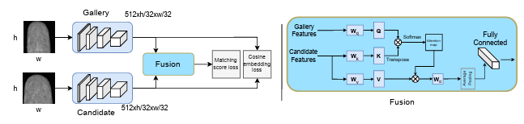

# UFQA: Utility Guided Fingerphoto Quality Assessment

This repository contains the official implementation of the paper:  
**"UFQA: Utility Guided Fingerphoto Quality Assessment"**  
*Amol S. Joshi, Ali Dabouei, Jeremy Dawson, Nasser Nasrabadi*  
[📄 Paper Link](https://arxiv.org/abs/2407.11141)

UFQA is a self-supervised dual encoder framework for predicting fingerphoto quality scores aligned with biometric matching performance. The model leverages quality maps for additional supervision, ensuring both global utility and local image quality are accurately captured.

---

## 📌 Abstract
Quality assessment of fingerphotos i.e. fingerprints captured using smartphone or digital cameras, is essential for reliable biometric recognition. UFQA uses a self-supervised dual encoder architecture to fuse features in latent space, predicting a quality metric aligned with utility in matching scenarios. Experiments show UFQA outperforms NFIQ2.2 and other state-of-the-art image quality assessment algorithms on multiple public datasets.

---

## 🏗 Architecture
  
*UFQA architecture: dual encoders with quality map supervision.*

---

## ✨ Features
- **Self-supervised dual encoder** for latent feature fusion.
- **Quality map supervision** for robustness to local distortions.
- Predicts **utility-aligned quality scores** for biometric matching.
- Outperforms **NFIQ2.2** and other metrics on multiple datasets.

---

## ⚙️ Installation
```bash
git clone https://github.com/ajoshi944/Fingerphoto-Quality.git
cd UFQA
pip install -r requirements.txt
```
## 🚀 Usage
```bash
python train.py --exp_name name_of_the_experiment
```
** Testing **
```bash
python test.py \
  --exp_name name_of_the_experiment \
```
## 📂 Datasets

Public fingerphoto/fingerprint datasets as referenced in the paper

Quality maps generated via NIST Mindtct (follow dataset/tool licenses)

Note: Some datasets require requests/agreements from providers. This repo does not redistribute any third-party data.


## 📊 Results

Summarized results and ablations are reported in the paper. Example table template (replace with your final numbers):

Method	Dataset A (metric)	Dataset B (metric)	Notes
NFIQ2.2	xx.x	xx.x	Baseline IQA
Baseline CNN	xx.x	xx.x	Supervised
UFQA (Ours)	xx.x	xx.x	Dual encoder + quality maps

For full metrics, protocols, and statistical significance, please refer to the publication.

## 📚 Citation

If you use this work, please cite:

@article{joshi2024ufqa,
  title={UFQA: Utility Guided Fingerphoto Quality Assessment},
  author={Joshi, Amol S. and Dabouei, Ali and Dawson, Jeremy and Nasrabadi, Nasser},
  journal={arXiv preprint arXiv:2407.11141},
  year={2024}
}

## 📜 License

This code is released for research purposes only.
Commercial use is prohibited without prior written permission from the authors.
See the LICENSE for full terms.

📬 Contact

Questions or collaborations: ajoshi944@gmail.com


